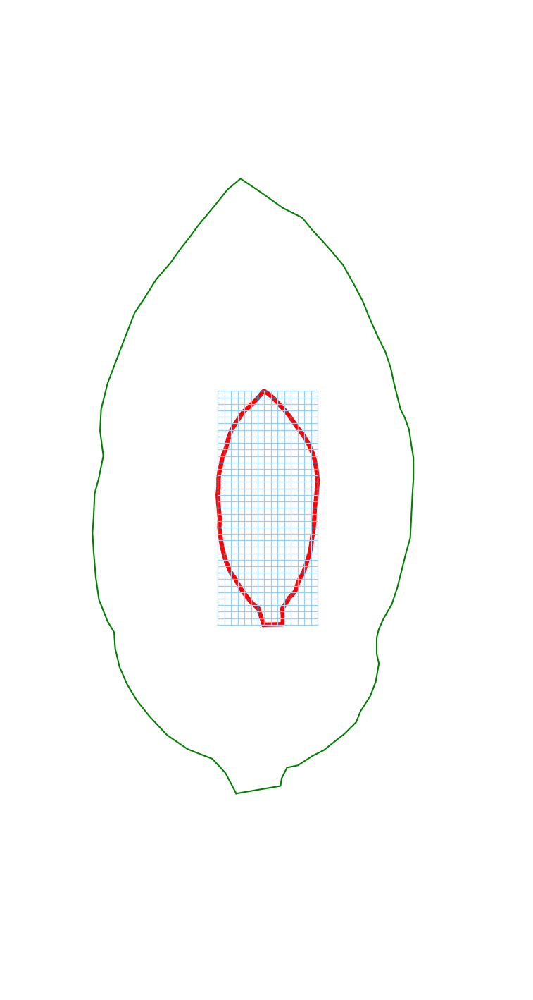
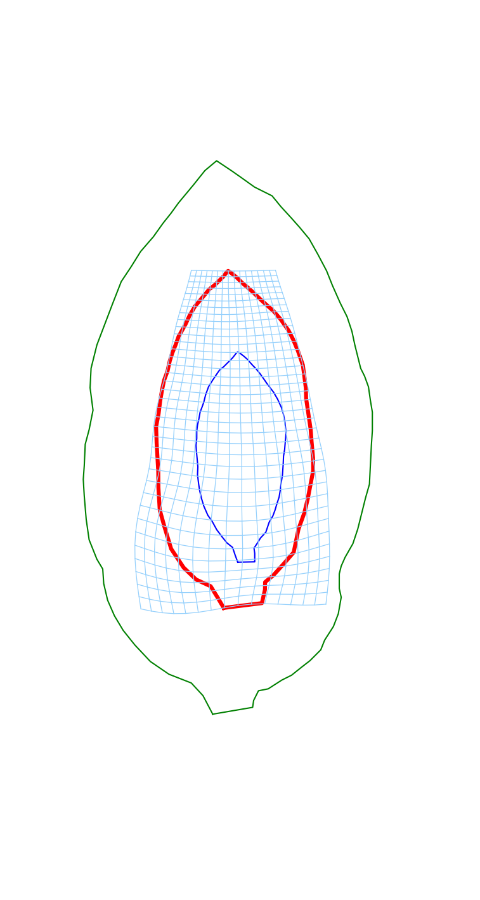
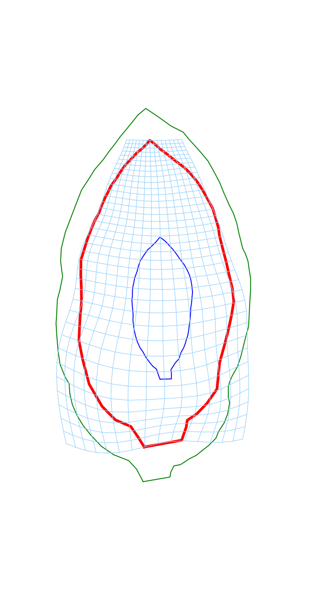
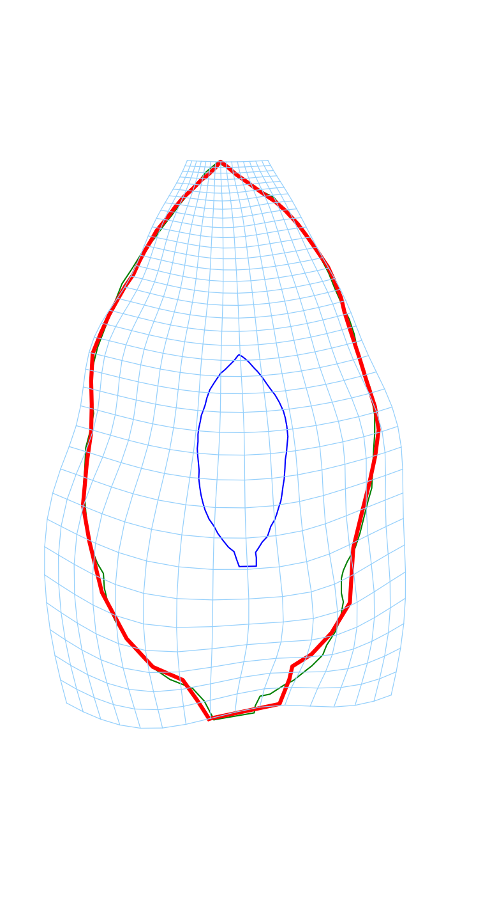

=============================
IMODAL
=============================

-----------------------------
Implicit Modular Deformations Analysis Library
-----------------------------

IMODAL is a python librairy allowing to register shapes (curves, meshes, images) with **structured large deformations**. The structures are incorporated via **deformation modules** which generate vector fields of particular, chosen types. They can be defined *explicitly* (generating local scalings or rotations for instance) or *implicitly* from constraints. In addition, it is possible to combine them so that a complex structure can be easily defined as the superimposition of simple ones. Trajectories of such modular vector fields can then be integrated to build *modular large deformations*. Their parameters can be optimized to register observed shapes and analyzed.

Here is an example of reconstruction of basipetal growth using IMODAL:

.. image:: figures/basipetal_learntmodel_reshoot_deformed_growth_3.png
  :width: 120

IMODAL provides:

- Registration of points clouds, curves, meshes and images
- Atlas computation with hypertemplate
- Estimation of the model parameters
- tools to speed up and reduce the memory footprint ( such as GPU and KeOps support)

Authors:

- Benjamin Charlier
- Leander Lacroix
- Barbara Gris
- Alain Trouvé

Related publications:

- `A sub-Riemannian modular framework for diffeomorphism based analysis of shape ensembles <https://hal.archives-ouvertes.fr/hal-01321142v2>`_, B. Gris, S. Durrleman and A. Trouvé, SIAM Journal of Imaging Sciences, 2018.
- `IMODAL: creating learnable user-defined deformation models`_, B. Charlier, L. Lacroix, B. Gris, A. Trouvé, CVPR, 2021.

The project can be downloaded `here <https://plmlab.math.cnrs.fr/gris/implicitmodules>`_.

Table of content
================

.. toctree::
   :maxdepth: 2

   introduction/installation

.. toctree::
   :maxdepth: 2
   :caption: Deformation modules

   modules/index
   _auto_tutorials/index
   _auto_examples/index

.. toctree::
   :maxdepth: 3
   :caption: Documentation

   documentation/index

..
   .. toctree::
      :maxdepth: 2
      :caption: Tutorial

      _auto_examples/index

